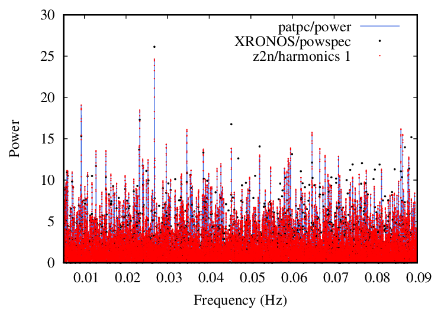

### photon arrival time periodicity code (patpc)
This code will search for a period in photon arrival times (as opposed to "countrate as a function of time" = "lightcurve") data in the context of X-ray and gamma-ray astronomy. This is a C implementation of the Hm test [(de Jager, Raubenheimer & Swanepoel, 1989)](https://ui.adsabs.harvard.edu/abs/1989A&A...221..180D). The chance occurrence probability for a periodogram peak is calculated as `Prob(> H) = exp (−0.4H)` following equation (5) of [de Jager & Büsching (2010)](https://ui.adsabs.harvard.edu/abs/2010A&A...517L...9D) and corrected for multiple trials using an estimate of the number of independent frequencies as suggested by [Schwarzenberg-Czerny (2003)](https://adsabs.harvard.edu/abs/2003ASPC..292..383S). While writing the code I was following the explanation of the Hm test by [Kerr (2011)](http://adsabs.harvard.edu/abs/2011ApJ...732...38K). The code makes use of multiple processing cores thanks to [OpenMP](https://en.wikipedia.org/wiki/OpenMP).

A detailed description of patpc is given in the Appendix by [Sokolovsky et al. (2022)](https://ui.adsabs.harvard.edu/abs/2022ApJ...934..142S/abstract).

### Requirements
In order to compile and run the code you'll need:
* A C compiler (tested with `gcc`)
* `GNU make` (you'll need to install it if you are on Mac or something)
* [CFITSIO library](https://heasarc.gsfc.nasa.gov/fitsio/) (optional, needed to read [OGIP FITS event files](https://heasarc.gsfc.nasa.gov/docs/heasarc/ofwg/docs/events/ogip_94_003/ogip_94_003.html))
* [GNU Scientific Library](https://en.wikipedia.org/wiki/GNU_Scientific_Library) (optional)
* [gnuplot](https://en.wikipedia.org/wiki/Gnuplot) and [ImageMagick](https://en.wikipedia.org/wiki/ImageMagick) `convert` for plotting (optional)

### Installation
Download and unpack the archive or clone this repository, then run `make`.

### Usage
Specify the [OGIP FITS event file](https://heasarc.gsfc.nasa.gov/docs/heasarc/ofwg/docs/events/ogip_94_003/ogip_94_003.html) or a single-column ASCII file listing the photon arrival times in seconds as the command line argument:
````
./patpc event_file.evt
````
or
````
./patpc photon_arrival_times.txt
````
This will print the parameters of the highest peak of the Hm periodogram and the power spectrum to the terminal. The code will also try to create plots of the power spectrum, Hm periodogram, binned lightcurve as a function of time, binned lightcurve as a function of phase (folded with the period corresponding to the highest Hm periodogram peak).
You may modify the plots by editing `plot_everything.gnuplot` and re-running `gnuplot plot_everything.gnuplot`.

You may also manually specify the search parameters:
````
./patpc event_file.evt 5000 5 0.1
````
where 5000 is the maximum trial period in seconds, 5 is the minimum trial period in seconds, 0.1 is the maximum phase shift between the first and the last point of the lightcurve (determines the width of the step between the trial frequencies).

### Example plots


Comparison of the power spectra computed with `patpc`, [XRONOS](https://heasarc.gsfc.nasa.gov/xanadu/xronos/xronos.html)/`powspec`
and [z2n-periodogram](https://github.com/YohanAlexander/z2n-periodogram) codes from the same event file.
The slight difference with [XRONOS](https://heasarc.gsfc.nasa.gov/xanadu/xronos/xronos.html)/`powspec`
is because it computes a different thing: rather than follow the Discrete
Fourier Transform definition directly ([Deeming, 1975](https://ui.adsabs.harvard.edu/abs/1975Ap%26SS..36..137D/abstract)) 
as `patpc` and `z2n-periodogram` do, 
`powspec` produces a binned ``lightcurve'' with a regular sampling where most of 
the measurements are 0 (no photons arrived), 
some measurements are equal to 1 (one photon arrived) and maybe some bins have more than one photon.
Then `powspec` runs an FFT on this lightcurve. Overall, this procedure is
similar, but not the same as computing the Discrete Fourier Transform over
the list of photon arrival times.

### swift_pointing_evt_splitter
This utility splits event files (FITS or ASCII) into separate chunks whenever there is a gap larger than 1000 seconds between consecutive events. 
This is useful for handling observations with multiple pointings, such as Swift satellite observations. The tool reads photon arrival times, 
identifies time gaps, and creates separate output files for each continuous observation segment. Output files are automatically named with sequential numbering 
(e.g., `inputfile_01.evt`, `inputfile_02.evt`, etc.). When compiled with CFITSIO support, it can process both FITS event files and plain text files; 
otherwise, it handles text files only.

````
./swift_pointing_evt_splitter event_file.evt
````
or
````
./swift_pointing_evt_splitter photon_arrival_times.txt
````


### Contribute

Bug reports, pull requests and feature suggestions are warmly welcome!
